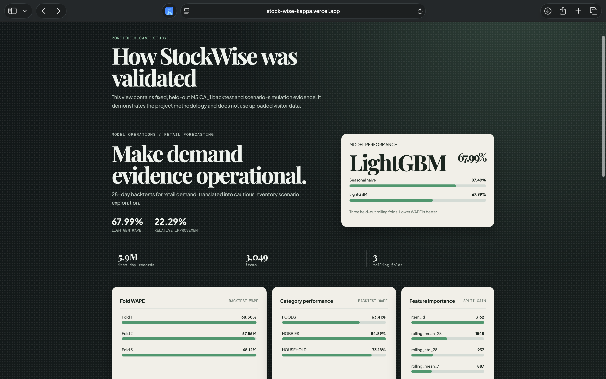
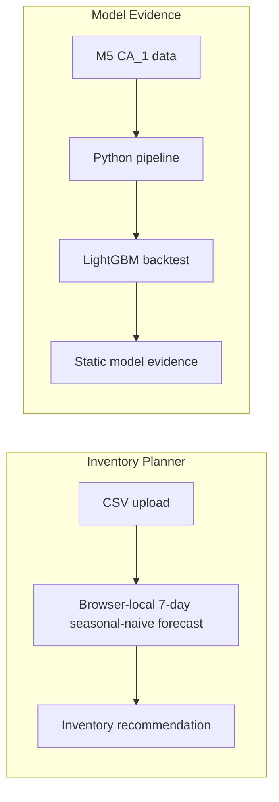

# StockWise — Retail Demand & Inventory Planner

StockWise is a retail demand forecasting and inventory-planning project that turns sales history into transparent ordering scenarios and documents a rigorously validated M5 `CA_1` forecasting case study.

[Live App](https://stock-wise-kappa.vercel.app) · [Repository](https://github.com/4ryxn/StockWise)

## What you can do

### Upload your own sales data

The **Inventory Planner** is the primary tool. Upload a daily-sales CSV with `date`,
`item_id`, and `units_sold`; select an item; then set on-hand stock, lead time, service
level, and a safety-stock multiplier. The browser creates a recursive 7-day
seasonal-naive forecast and an inventory-order scenario.

Your file is processed only in the browser. It is never sent to a backend, stored, or
persisted, and it disappears on refresh. This uploaded-data planner uses a local
seasonal-naive method—not LightGBM.

### Explore validated M5 model evidence

The **Model Evidence** view is a fixed portfolio case study based on the M5 Forecasting
Accuracy dataset, store `CA_1`. It presents held-out LightGBM backtests, feature
importance, and inventory-policy scenario results. These figures are precomputed project
evidence, not live retailer data, and they do not change when a visitor uploads a CSV.

## Screenshots

### Inventory Planner


Browser-local sales CSV planning and inventory recommendations.

### Model Evidence



Held-out LightGBM backtest performance on M5 CA_1.

### Inventory Policy Lab


Service-level and safety-stock scenario exploration.

## Results

Lower WAPE is better. The global LightGBM model was evaluated on the same three held-out
rolling folds as the seasonal-naive baseline.

| Model | Combined WAPE | Comparison |
| --- | ---: | --- |
| 7-day seasonal naive | 87.49% | Baseline |
| Global LightGBM | **67.99%** | **22.29% relative WAPE improvement** |

Validation covers **5,918,109 item-day rows**, **3,049 CA_1 items**, and **three** rolling
held-out folds.



## How the inventory recommendation works

For an uploaded item, StockWise uses the most recent 28 consecutive daily observations.
The first seven forecast days copy the final seven observed days; later forecast days repeat
the value forecast seven days earlier. This is a recursive 7-day seasonal-naive forecast.

For a selected lead time, the planner calculates:

```text
lead-time demand = sum of forecast demand from day 1 through the lead time
safety stock = z-score × historical daily-demand standard deviation × √lead time × multiplier
recommended order = max(0, ceil(lead-time demand + safety stock − current on-hand inventory))
days of cover = current on-hand inventory ÷ average daily forecast
```

The service-level z-scores are 1.282 (90%), 1.645 (95%), 1.96 (97.5%), and 2.326 (99%).
The output is an inventory-planning scenario, not a live demand guarantee.

## Model validation

The M5 model evidence uses three fixed, rolling 28-day validation windows:

| Fold | Validation days |
| --- | --- |
| Fold 1 | `d_1858`–`d_1885` |
| Fold 2 | `d_1886`–`d_1913` |
| Fold 3 | `d_1914`–`d_1941` |

The global LightGBM model uses a recent 730-day training window before each cutoff and
generates each 28-day validation horizon recursively. Its feature set contains leakage-safe
demand lags (`1`, `7`, `14`, `28`), shifted rolling means and standard deviation, known
calendar fields, and item/category/department identifiers. `sell_price` is deliberately
excluded because future prices are not available at forecast time; no target-day demand is
used as a feature.

Inventory-policy evaluation is a lost-sales scenario simulation with a 7-day lead time and
a 7-day review cycle. It compares a fixed historical policy with a forecast-driven policy.

## Project structure

```text
.
├── .github/workflows/ci.yml       # Python lint and test workflow
├── artifacts/                     # Local generated reports and model outputs (ignored)
├── data/
│   ├── raw/                       # Local M5 source CSVs (ignored)
│   ├── interim/                   # Local intermediate data (ignored)
│   └── processed/                 # Local Parquet partitions (ignored)
├── frontend/
│   ├── public/data/               # Compact static dashboard/planner JSON
│   └── src/                       # React, TypeScript, local planner, and Vitest tests
├── src/stockwise/
│   ├── data/                      # M5 validation and transformation
│   ├── forecasting/               # Baseline, features, validation, and LightGBM backtest
│   ├── analysis.py                # EDA and data-quality artifacts
│   ├── inventory*.py              # Policy backtest and sensitivity analysis
│   └── cli.py                     # `stockwise` command-line entry point
├── tests/                         # Python unit tests
├── DECISIONS.md                   # Architecture decision log
├── PROJECT_CONTEXT.md             # Project handoff context
└── pyproject.toml                 # Python package and tool configuration
```

## Local setup

### Python pipeline and tests

Requires Python 3.11 or later.

```bash
python -m venv .venv
source .venv/bin/activate
python -m pip install -e '.[dev,data,modeling]'
pytest
ruff check .
```

To reproduce the M5 ingestion pipeline, download the M5 source files and place them in
`data/raw/`:

- `calendar.csv`
- `sell_prices.csv`
- `sales_train_evaluation.csv`

Then validate and build the `CA_1` dataset:

```bash
stockwise validate-m5 data/raw --store-id CA_1
stockwise build-m5 data/raw data/processed/ca_1 --store-id CA_1
```

The build command refuses to write into a non-empty output directory. Raw and processed data
are intentionally excluded from Git.

### Static frontend

```bash
cd frontend
npm install
npm run dev
npm test
npm run build
```

The frontend is a static React + TypeScript + Vite application deployed on Vercel. It does not
require a backend, database, authentication, or environment variables.

## Limitations and responsible use

- The uploaded-data planner uses a local 7-day seasonal-naive forecast, not the M5 LightGBM
  model.
- Model Evidence is static, precomputed M5 `CA_1` validation evidence; it is not a live
  retailer feed or live prediction service.
- M5 provides sales, not observed inventory, receipts, orders, or unmet demand. Inventory
  policy outcomes are therefore simulations, not historical inventory outcomes.
- StockWise is not a production ERP or live inventory-system integration. Business deployment
  would require current inventory positions, supplier constraints, replenishment calendars,
  operational review, and monitoring.

## Why this project matters

StockWise connects data analysis, data science, and ML engineering in one transparent product:
memory-conscious retail-data preparation and quality checks; leakage-safe time-series
validation and model comparison; recursive forecasting; reproducible scenario simulation; and
a privacy-preserving static frontend that translates modeling evidence into a usable planning
workflow.

## Data attribution

The model-evidence case study uses the M5 Forecasting Accuracy dataset, scoped to store `CA_1`.
The source data is not included in this repository.
